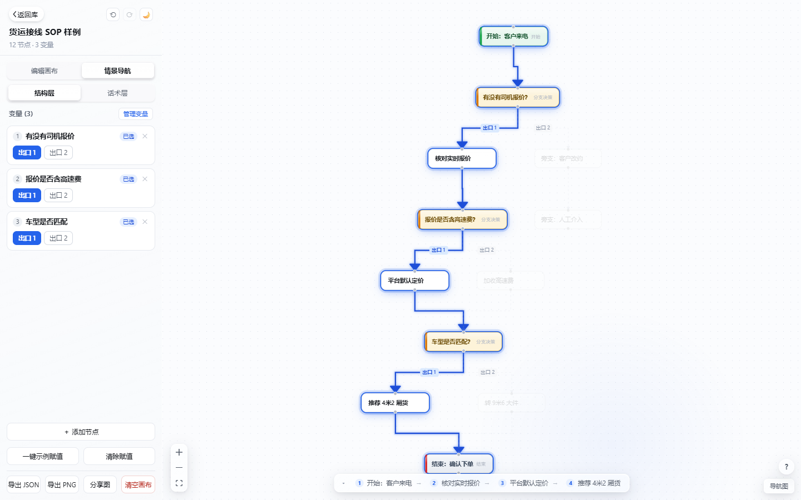
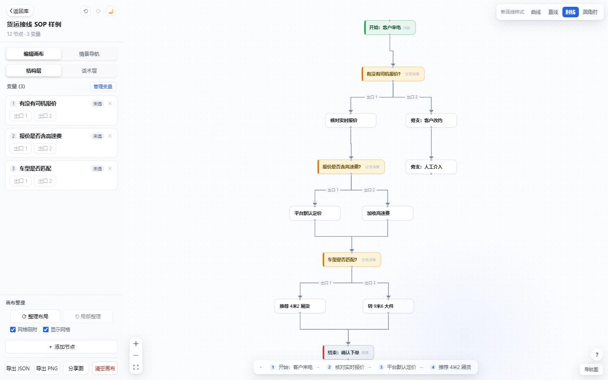

# Flow Navigator · 变量导航器

把一张复杂的 SOP 流程图，按变量取值**实时收敛成一条可执行路线**。

给「复杂流程图读不懂」的人做的工具：把决策点标记为变量，选择取值，画布上立刻只剩一条高亮的路线 —— 走过的路发光，没走的路置灰。



## 它解决什么问题

传统流程图工具（ProcessOn / drawio / Miro）画出的是一张**静态全景图**：节点一多，读者要在几十个框和箭头里自己找路。Flow Navigator 的思路不同 —— **流程图不该被"看"，该被"走"**：

| 传统流程图 | Flow Navigator |
|---|---|
| 全部节点同等重要 | 选定变量后，路线高亮、无关分支置灰 |
| 读者自己找路径 | 变量取值驱动，路线实时收敛 |
| 截图发群里靠嘴解释 | 一键导出 1200×630 分享图 |
| 改一次截图重发一次 | 发链接，对方自己走路线 |

## 功能

- **画布编辑** — 节点拖拽（带对齐参考线与吸附）、自动布局（dagre）、**左键拖空白框选多个** + Shift/Ctrl+单击多选、撤销/重做
- **画布导航** — 空格 / 右键 + 拖动平移画布；滚轮/触控板双指滑动上下左右滚动；Ctrl+滚轮或双指捏合缩放（左键拖留给框选，与飞书/Figma 一致）
- **变量系统** — 把任意决策点设为变量；情景导航模式下选择取值，实时驱动路线。支持**返工回路**：从后方的节点连回前方形成循环（审核打回、重新申请）也能正确导航——同一判断点每次经过可做不同选择，配合「上一步 / 下一步」随时回退重走
- **路线高亮** — 三级视觉语义：未走完（流动虚线）→ 已确定（发光管道 + 一次性流光）→ 无关置灰（去色 + 降透明度）；情景导航可一键切「全图」视角（保留路线强调、不压暗其他内容）或「⟲ 重置」从头再走
- **上下游链路追踪** — 情景导航 / 只读浏览模式下，单击节点高亮它的全部上游与下游，再点切换相邻档（编辑模式单击只选中该节点，双击进入改名）
- **导入飞书画板** — 在飞书文档画板里 `Ctrl+C` 复制流程图，到这里 `Ctrl+V` 直接粘贴：自动识别形状（矩形→步骤、菱形→判断）、连线分支文字→变量选项，可选保留原布局或自动整理；连线样式可挑**肘线 / 曲线 / 直线**三种
- **数据不丢** — 图库除存 IndexedDB 外，桌面版还会把整份图库**镜像备份到本机文件**（`%APPDATA%\com.flownavigator.app\flow-library.json`，每天保留一份快照、最多 7 天）。升级 / 重装 / 清理 WebView 数据后启动时自动比对恢复，流程图一张不丢
- **画布搜索** — `Ctrl+F` 搜节点名 / 类型 / 话术，回车逐个跳转
- **命令面板** — `Ctrl/Cmd+K`，21 条命令 + 节点跳转，支持拼音首字母外的全文本过滤
- **话术层** — 每个节点可写执行话术（谁说、说什么），结构层与话术层双视图
- **导出** — JSON（可再导入）、PNG、1200×630 分享卡
- **快捷键 / 引导** — `?` 呼出快捷键与功能引导



## 下载使用

### 桌面版（推荐）

到 [Releases](../../releases) 下载对应平台安装包（打 tag 后自动构建）：

| 平台 | 格式 |
|---|---|
| Windows | `.exe`（NSIS，**支持自动更新**）/ `.msi`（不支持自更新，仅 IT 批量部署用） |
| macOS Apple Silicon | `aarch64.dmg` |
| macOS Intel | `x64.dmg` |
| Linux | `.deb` / `.AppImage` / `.rpm` |

**自动更新**：Windows NSIS 安装版启动时会自动检查 GitHub Releases 新版本（v0.1.4+），发现新版弹窗确认后即下载安装、自动重启，无需手动重装。也可在主页标题旁「ⓘ」关于面板里点「检查更新」手动触发。

<details>
<summary><strong>🍎 macOS 用户：首次打开提示「已损坏，无法打开」怎么办</strong></summary>

这是 macOS Gatekeeper 的门禁——安装包**没有损坏**，只是未经过 Apple 公证（开发者账号 $99/年，本项目暂未购买），从网上下载的应用会被打上隔离标记。

**方法一（终端，最稳妥）** —— 装到「应用程序」后执行一次：

```bash
sudo xattr -rd com.apple.quarantine "/Applications/Flow Navigator.app"
```

输入开机密码（输入时屏幕不显示字符，回车即可），之后正常双击打开。若提示 `No such xattr`，改跑这条：

```bash
xattr -cr "/Applications/Flow Navigator.app"
```

**方法二（图形界面）**：系统设置 → 隐私与安全性 → 滚到「安全性」→ 找到「Flow Navigator 已被阻止…」→ 点 **仍要打开**。

**方法三（从根上避免）**：用终端下载——命令行下载的文件不会被打隔离标记，装完即可直接打开：

```bash
cd ~/Downloads
curl -LO https://github.com/renoo777/flow-navigator/releases/latest/download/Flow.Navigator_0.1.5_aarch64.dmg
```

（M 系列用 `aarch64`，Intel 把链接末尾改成 `x64`）

**校验**（可选，确认安装包本身没问题）：

```bash
codesign -dv --verbose=4 "/Applications/Flow Navigator.app" 2>&1 | head
```

看到 `Signature=adhoc` 属正常（未付费签名的开源应用都是这样）。

> 选安装包：M 系列芯片选 `aarch64.dmg`，Intel 芯片选 `x64.dmg`（M 系列也能跑 `x64.dmg`，走 Rosetta 转译，略慢）。

</details>

数据全部保存在本机（浏览器 localStorage / WebView 存储），**无账号、无上传、离线可用**。

### 在线版

无需安装，直接打开：**https://renoo777.github.io/flow-navigator/**（GitHub Pages，main 分支更新即自动部署）

> 在线版与桌面版一样：数据只存本机浏览器，不上传服务器、无需注册。

## 本地开发

```bash
# 环境要求：Node.js ≥ 20；桌面端另需 Rust 工具链 + 系统依赖（见下）
npm install

npm run dev          # Web 开发（http://127.0.0.1:5191）
npm run build        # 生产构建（产物在 apps/web/dist）
npm run typecheck    # TypeScript 全量类型检查
npm run test         # vitest 单元测试

npm run tauri:dev    # 桌面端开发（需 Rust）
npm run tauri:build  # 桌面端打包（产物在 src-tauri/target/release/bundle）
```

### 桌面端构建前置

| 平台 | 依赖 |
|---|---|
| Windows | [Rust](https://rustup.rs) + Visual Studio Build Tools（C++ 工作负载）；WebView2 Win10/11 自带 |
| macOS | Rust + Xcode Command Line Tools |
| Linux | Rust + `libwebkit2gtk-4.1-dev libappindicator3-dev librsvg2-dev patchelf` |

## 技术栈

- **前端**：React 18 · TypeScript · Vite · Zustand · React Flow v12 · Tailwind CSS 4
- **桌面**：Tauri 2（系统 WebView，安装包 3–5MB，无 Chromium 捆绑）
- **布局**：dagre（自动整理）· elkjs
- **工程**：npm workspaces monorepo（`@flow/core` 纯函数内核 / `@flow/canvas` 画布 / `@flow/dock` 侧栏 / `@flow/web` 入口）
- **动效**：Liquid Glass 设计语言 —— `linear()` 弹簧缓动、独立变换属性、squash & stretch 分段滑块、非对称时序（进场瞬时/退场 150ms）

## 发布流程（维护者）

```bash
# 1. 版本号已一致（package.json / src-tauri/tauri.conf.json）
# 2. 打 tag 即触发桌面端三平台构建（GitHub Actions），产物以 Draft Release 挂出
git tag v0.1.4
git push origin v0.1.4
# 3. 到 Releases 页确认后点 Publish 对外发布（**草稿态不计入 latest，自动更新不会生效**）
#    —— 发布后已装用户的桌面版下次启动即自动收到更新（v0.1.4+ 支持）
#    仓库：https://github.com/renoo777/flow-navigator ｜ Web 版：https://renoo777.github.io/flow-navigator/
# 4. CI 若报 `'tauri' is not recognized`，是 workflow 缺 npm ci（已修复，勿删）
```

### 自动更新（updater）说明

- 发布产物会额外生成 `latest.json`（各平台安装包的签名 + 下载地址清单），自动挂到 Release。
- 客户端启动时请求 `tauri.conf.json → plugins.updater.endpoints`（GitHub 仓库的 `releases/latest/download/latest.json`）比对版本。
- 更新签名密钥：私钥在本机 `~/.tauri/flow-navigator.key`（**勿提交仓库、务必备份**），公钥已写入 `tauri.conf.json`。
- **首次在 GitHub Actions 发版前**，需在仓库 `Settings → Secrets and variables → Actions` 添加两个 Secret：
  - `TAURI_SIGNING_PRIVATE_KEY`：私钥文件**内容**
  - `TAURI_SIGNING_PRIVATE_KEY_PASSWORD`：生成私钥时设置的密码
- Fork 或改名后，需同步修改 `tauri.conf.json → plugins.updater.endpoints` 指向自己的仓库，否则自动更新仍会指向上游。

## 支持作者 · 打赏

如果它真的帮你把一条 SOP 流程图"走"明白了，欢迎请作者喝杯咖啡 ☕。


主页（流程图库）「变量导航器」标题旁点「ⓘ」打开关于面板，其中「支持作者」默认折叠，点开即可见微信/支付宝收款码（双码已嵌入，离线可用）；亦可通过下方通道：

- **微信赞赏码 / 支付宝收款码** — 见应用内关于面板的「支持作者」折叠区（面板内展示收款人备注，付款前请核对）
- **GitHub Sponsors** — 暂未开通（大陆 Visa/MasterCard 渠道暂不友好），如需开通可在 Issues 告知

费用：

| 通道 | 手续费 | 单笔上限 |
|---|---|---|
| 微信赞赏码 | 0.38%（平台抽） | ≤ 200 元 |
| 支付宝个人收款码 | 0%（自定） | ≤ 1000 元 / 日 ≤ 5 万 |
| GitHub Sponsors（暂未开通） | 跨境通道 | 取决于发卡行 |

打赏纯自愿，与功能解锁无关 —— 每一笔都会花在更多打磨这件小事的周末下午茶 🍵。

## License

[MIT](LICENSE)
